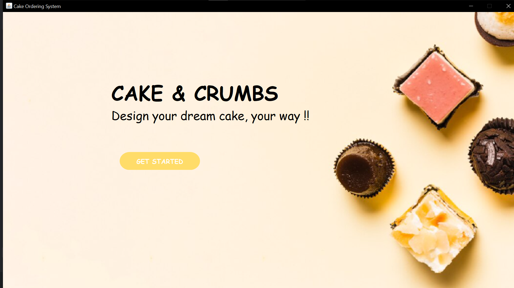
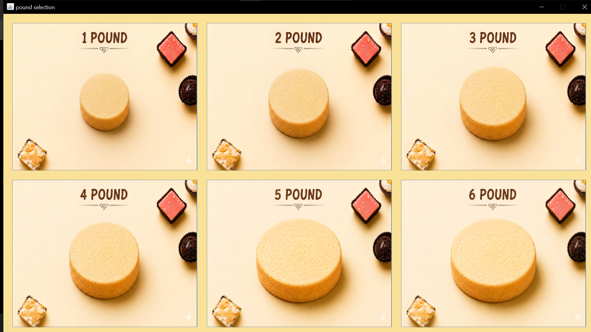
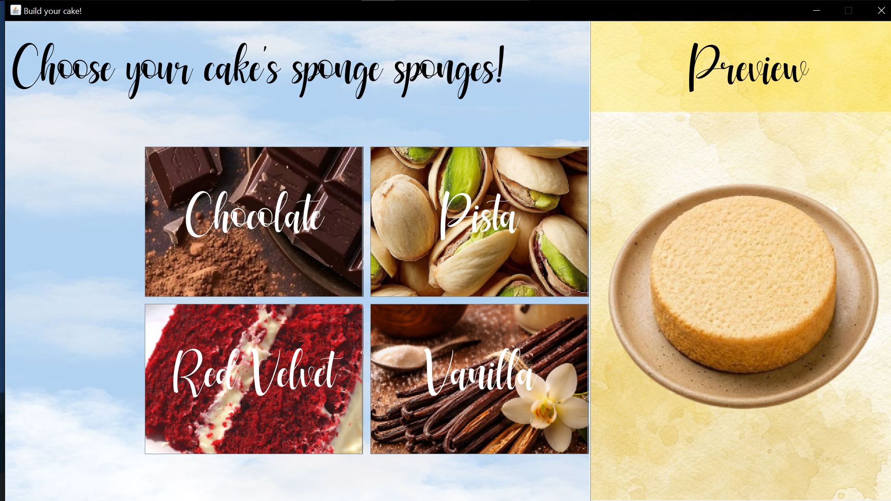
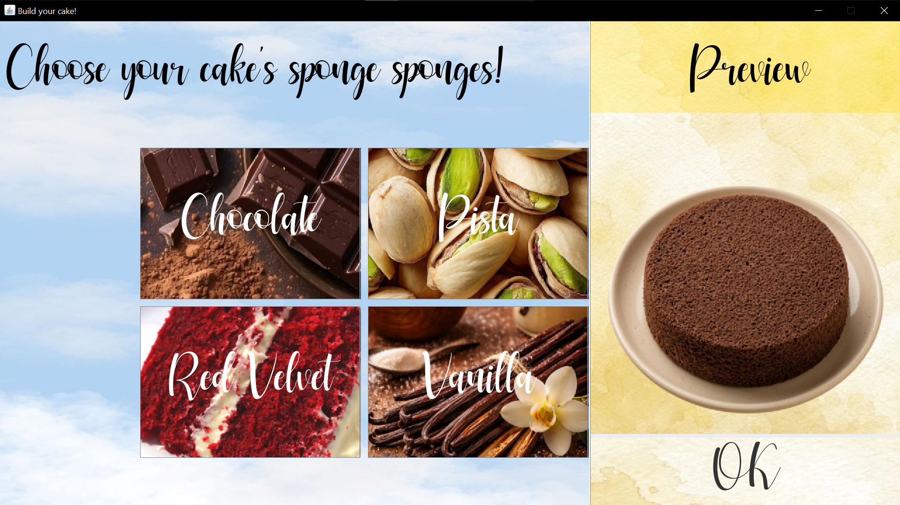
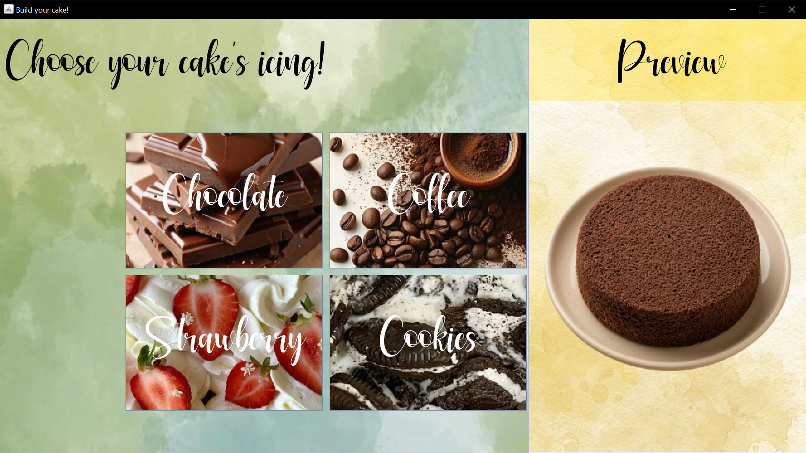
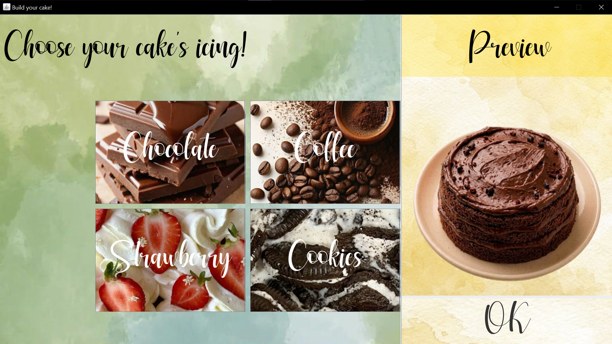
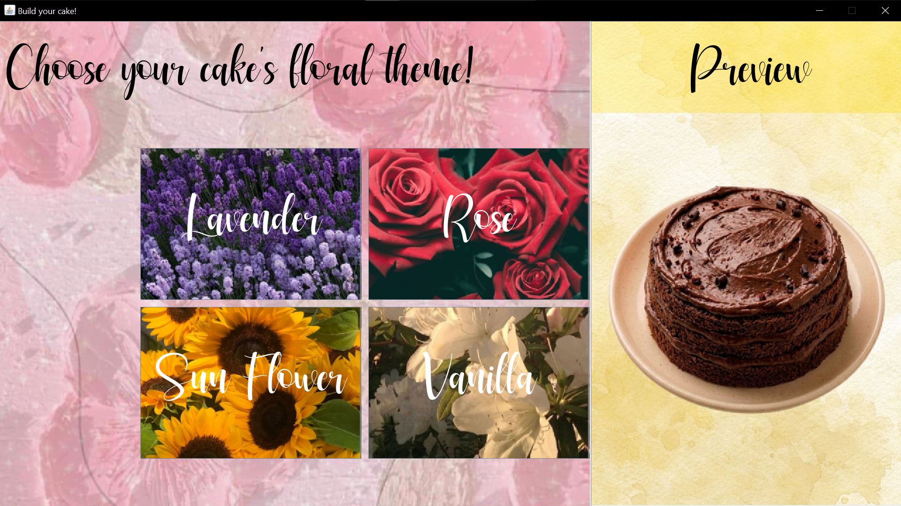
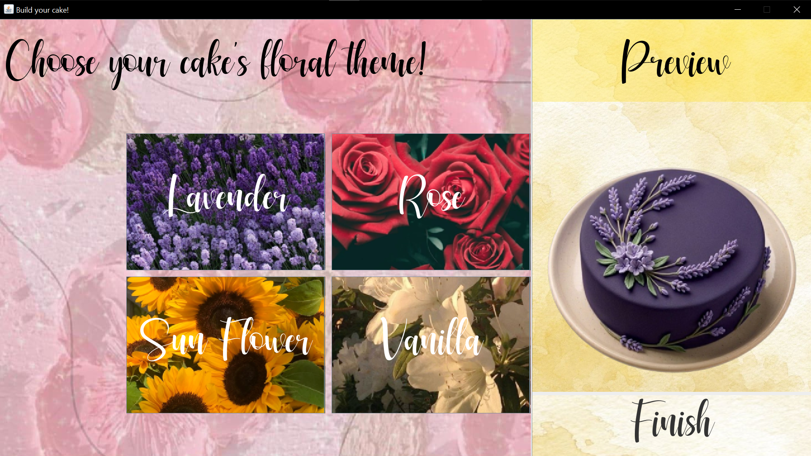
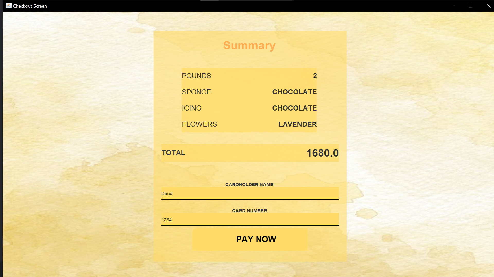
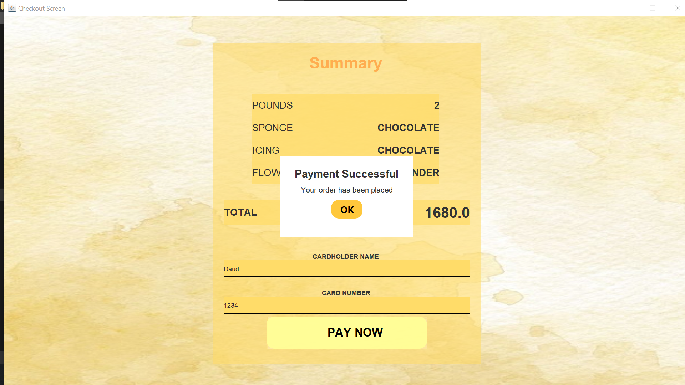

# 🎂 Customizable Cakes – OOP Project

## 📌 Overview
Customizable Cakes is a Java-based desktop application developed using Object-Oriented Programming (OOP) principles. The application allows users to design a cake by selecting different components such as sponge, icing, and decorations through an interactive graphical user interface (GUI).

The system is designed with modularity in mind, where each cake component is implemented as a separate class. This makes the application flexible, maintainable, and easy to extend with new features.

---

## 🚀 Features
-  Select different sponge types
-  Choose icing flavors
-  Add decorative elements (flowers, etc.)
- ️ Interactive GUI with multiple screens
-  Smooth transition between modes (Sponge → Icing → Decoration)
-  Real-time preview of cake customization

---

## 🛠️ Technologies Used
- Java
- Java Swing (GUI)
- IntelliJ IDEA
- Git & GitHub

---

## ▶️ How to Run the Project

1. Clone the repository:
   ```bash
   git clone https://github.com/javeriakhan776/customizable-cakes.git
   ```

2. Open the project in IntelliJ IDEA

3. Locate and run the main class

4. The GUI will launch, allowing you to build your custom cake

---

## 🧠 OOP Concepts Used

### 🔹 Encapsulation
Each class (such as Cake, Sponge, Icing) encapsulates its own data and behavior, ensuring better organization and data protection.

### 🔹 Inheritance
Common properties and behaviors are reused through inheritance, allowing different components to extend base functionality.

### 🔹 Polymorphism
Different objects can be treated uniformly while still behaving differently depending on their type.

### 🔹 Abstraction
Complex logic is hidden behind simple interfaces, especially in the interaction between GUI components and backend logic.

---

## 🧱 Project Structure

### Core Logic (`src/logic`)
- `Cake.java` → Main class representing the cake
- `Sponge.java` → Defines sponge layer
- `Icing.java` → Defines icing layer
- `Flower.java` → Decorative element

### GUI (`src/gui`)
- `CakeBuilderScreen.java` → Main interface controller
- `states/` → Manages different modes (SpongeMode, IcingMode, FlowerMode)
- `components/` → UI elements such as buttons and panels

---

## 🔄 Application Flow
1. User selects a sponge
2. Proceeds to icing selection
3. Adds decorative elements
4. Final cake is previewed dynamically

---

## 📸 Screenshots
## 📸 Screenshots

### 👋 Welcome Screen


### 💰 Price / Pounds Screen


### 🍰 Sponge Selection



### 🍫 Icing Selection



### 🌸 Flower Selection



### 🎂 Checkout Flow




---

## 🎨 Assets & Resources
- Cake images were generated using AI tools (Gemini)
- Custom fonts were sourced from DaFont
- Image backgrounds were removed using remove.bg

These resources were used to enhance the visual appearance of the application.

---

## 👩‍💻 Authors
- Javeria Khan
- Isha Akhter

This project was developed as a 2nd semester Computer Science project using GitHub for version control and collaboration (push & pull workflow).

---

## 📈 Possible Improvements
- Add saving/loading cake designs
- Improve UI responsiveness
- Expand customization options
- Implement a pricing system

---

## 📜 License
This project is for educational purposes.